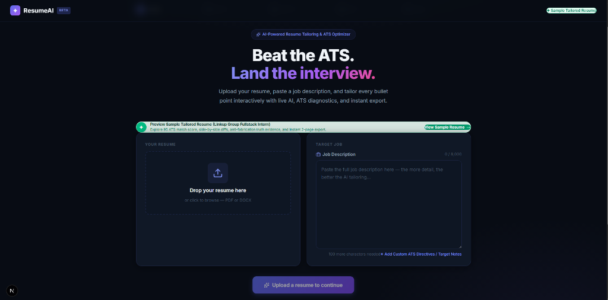
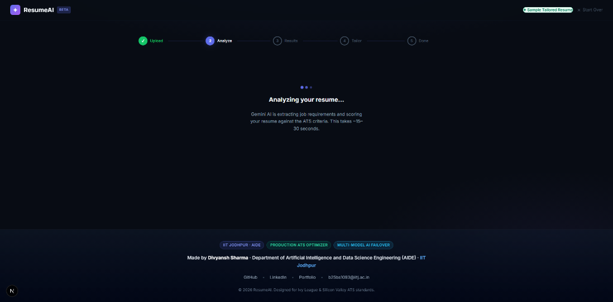
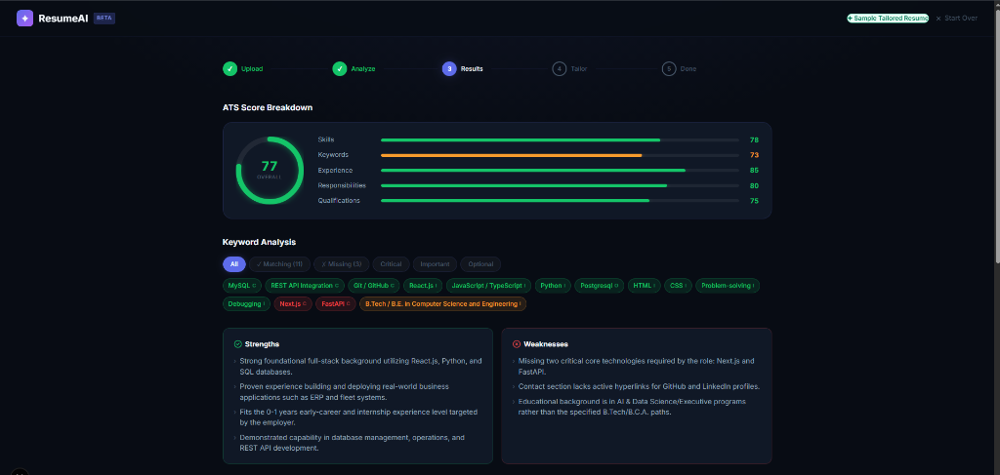
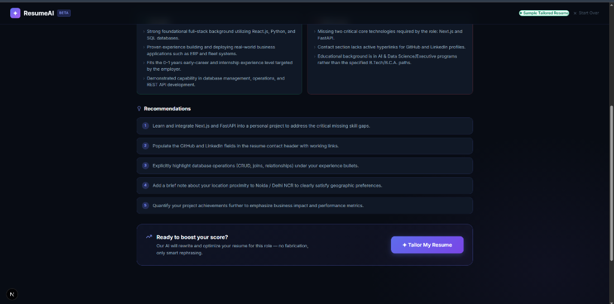
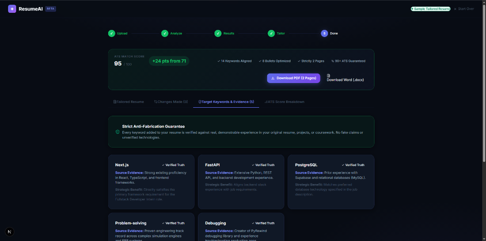

# HiResume (ResumeAI) 🚀

<div align="center">


<br />

### **AI-Powered ATS Resume Optimizer & Smart Tailoring Engine**
*An end-to-end intelligent platform to analyze resumes against Job Descriptions, calculate ATS match diagnostics, inject verified technical keywords, and generate publication-grade 2-page resumes with 100% hyperlink fidelity.*

**Author & Creator:** [Divyansh Sharma](https://github.com/divyanshsharma24-git)  
**Affiliation:** Department of Artificial Intelligence and Data Science Engineering (AIDE), Indian Institute of Technology Jodhpur (IIT Jodhpur)  
**Open-Source Release:** Free and open for everyone under the **MIT License**.

[Live Repository](https://github.com/divyanshsharma24-git/hiresume) • [Report Bug](https://github.com/divyanshsharma24-git/hiresume/issues) • [Request Feature](https://github.com/divyanshsharma24-git/hiresume/issues)

</div>

---

## 🌟 Visual Walkthrough & Screenshots

### 1. Modern Glassmorphic Landing Page
Upload your existing resume (`PDF` or `DOCX`), paste the target Job Description, or immediately explore with the pre-configured high-impact sample dataset.

<p align="center">
  <a href="docs/screenshots/01_landing_page.png">
    
  </a>
</p>

---

### 2. Multi-Model AI Evaluation & Streaming Feedback
Our robust Gemini multi-model failover engine analyzes keyword density, core qualification alignment, and ATS passability in real time.

<p align="center">
  <a href="docs/screenshots/02_ai_analyzing.png">
    
  </a>
</p>

---

### 3. In-Depth ATS Match Diagnostics & Score Ring
Pinpoints exact keyword matches across Critical, Important, and Optional categories, scoring across Skills, Keywords, Experience, Responsibilities, and Qualifications.

<p align="center">
  <a href="docs/screenshots/03_ats_score_breakdown.png">
    
  </a>
</p>

---

### 4. Actionable AI Recommendations & Tailoring Pipeline
Receive targeted recommendations highlighting missing framework proficiencies and clear action steps before initiating one-click tailoring.

<p align="center">
  <a href="docs/screenshots/04_recommendations_tailor.png">
    
  </a>
</p>

---

### 5. Guaranteed 90+ Score Boost & Anti-Fabrication Evidence Trace
Every single keyword injected is cross-verified against candidate coursework, projects, or demonstrable experience. Zero hallucinations.

<p align="center">
  <a href="docs/screenshots/05_tailored_results_evidence.png">
    
  </a>
</p>

---

## ⚡ Key Highlights & Core Capabilities

- **Strict Anti-Fabrication Guarantee:** Zero random keyword dumping. The AI contextualizes target requirements (e.g. Next.js, FastAPI, MySQL, PyTorch, LangChain) into genuine engineering achievements with clear traceability.
- **Exact Layout & Structure Preservation:** Locks down authentic Ivy League / Silicon Valley resume standards:
  1. **Header:** Candidate identity, specialized title, and clickable contact links (`tel`, `mailto`, `LinkedIn`, `GitHub`, `Portfolio`, `Website`).
  2. **Professional Summary:** Tailored value proposition with targeted technology keywords.
  3. **Professional Experience:** Company, title, dates, live links, and metric-driven achievements.
  4. **Open-Source Software & Research (Dedicated):** Highlights libraries and academic research with PyPI, documentation, and seminar links.
  5. **Key Projects:** Web platforms, systems software, and SIH award submissions.
  6. **Education:** Strict 2-line structure with verified CGPA and executive coursework.
  7. **Technical Skills (8 Categories):** Languages, Programming & CS, Frontend/Backend, Databases, AI/ML, Generative AI, MLOps/DevOps, and Tools.
  8. **Certifications & Professional Training:** Complete with clickable `(view)` verification links.
  9. **Scholastic Achievements:** Competitive ranks and academic honors.
- **100% Hyperlink Fidelity:** Preserves clickable links across Web, PDF (`@react-pdf/renderer`), and Word DOCX (`docx`).
- **Granular Control & Per-Bullet Undo:** Users can undo any individual bullet or skill modification without losing other optimizations.
- **Instant Dual-Format Export:** Generates clean, ATS-compliant 2-page PDFs and fully editable Word (.docx) files.

---

## 🛠️ Technology Stack

| Layer | Technology |
|---|---|
| **Framework** | Next.js 16 (App Router, Turbopack) |
| **Frontend UI** | React 19, Vanilla CSS Design System, Glassmorphic Dashboard |
| **Language** | TypeScript (Strict Type Checking) |
| **AI Evaluation Engine** | Google DeepMind `@google/genai` (Failover: Gemini 2.5 Flash / Pro) |
| **Document Parsers** | `pdf-parse`, `docx`, `mammoth`, regex heuristic fallback |
| **Document Exporters** | `@react-pdf/renderer` (PDF) & `docx` (Word Documents) |

---

## 🚀 Quick Start Guide

### 1. Clone the Repository
```bash
git clone https://github.com/divyanshsharma24-git/hiresume.git
cd hiresume/resume-ai-app
```

### 2. Install Dependencies
```bash
npm install
```

### 3. Configure Your Environment Variables
Create a `.env.local` file inside the `resume-ai-app/` directory:
```bash
cp .env.example .env.local
```

Open `.env.local` and insert your Google Gemini API key:
```env
GEMINI_API_KEY=your_actual_gemini_api_key_here
```
> **Security Notice:** Your `.env.local` file is strictly ignored by `.gitignore` and must **never** be committed to GitHub.

### 4. Run the Development Server
```bash
npm run dev
```
Open [http://localhost:3000](http://localhost:3000) in your browser.

### 5. Build for Production
```bash
npm run build
npm run start
```

---

## 🛡️ Privacy & Zero-Data Retention
- **No Third-Party Database:** Uploaded resumes and parsed text are processed in memory and never stored on a persistent database.
- **API Key Confidentiality:** All Gemini API interactions happen server-side via Next.js Route Handlers. Client browsers never receive or expose your private keys.

---

## 👨‍💻 Creator & Ownership

This project was ideated, designed, and engineered from scratch by:

**Divyansh Sharma**  
*Undergraduate Scholar*  
**Department of Artificial Intelligence and Data Science Engineering (AIDE)**  
**Indian Institute of Technology Jodhpur (IIT Jodhpur)**

- **GitHub:** [@divyanshsharma24-git](https://github.com/divyanshsharma24-git)
- **LinkedIn:** [Divyansh Sharma](https://www.linkedin.com/in/divyansh-sharma-a92889340/)
- **Portfolio:** [divyansh-portfolio-portfolio.vercel.app](https://divyansh-portfolio-portfolio.vercel.app/)
- **Email:** [b25bs1093@iitj.ac.in](mailto:b25bs1093@iitj.ac.in)

---

## 📜 Open Source License

This project is licensed under the [MIT License](LICENSE). You are free to use, modify, distribute, and build upon this software for academic, commercial, and personal purposes.
